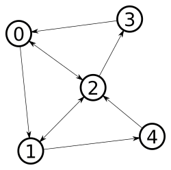

# Create Agents

Low level agents interact with Nodes and Arcs. They behave according to an
implemented behavior. This section will explain how to instantiate them and
implement some behaviors.

# Table of contents
1. [Example](#Example)
2. [Agent Hierarchy](#agent-hierarchy)
3. [Shuttle Behavior](#shuttle-behavior)
4. [Shuttle Body](#shuttle-body)
5. [Shuttle Agent](#shuttle-agent)
6. [Build Agents](#build-agents)

## Example

Let's create agents that move in the graph below, that has been implemented in the [previous section](Simple-Graph) : 



For the purpose of this example, we will start by creating *shuttle* agents
that perform round trips between two given nodes, using the shortest path.

## Agent hierarchy

Because shuttles are object moving in the graph, we will use the available "moving" classes.
- `ShuttleAgent`, child of `MovingAgent`
- `ShuttleAgentBody`, child of `MovingAgentBody`
- `ShuttleBehavior`, child of `MovingBehavior`


## Shuttle Body

Let's start implementing the `ShuttleBody` class. Think of it as the concrete
shuttle that moves in a city.

Create a class that extends `MovingAgentBody`. Your IDE should add the unimplemented functions : 
```java
public class ShuttleBody extends MovingAgentBody {

	@Override
	public void handleMove() {

	}

	@Override
	public void handleWait() {
		
	}

	@Override
	public void handleWander() {

	}

}
```

Those functions describe how the `ShuttleBody` will handle
[MoverActions](https://smartgov-liris.github.io/SmartGovSimulator/org/liris/smartgov/simulator/core/agent/moving/behavior/MoverAction.html)
that will then be provided by the `ShuttleBehavior`. For now, we will only
provide [MoverAction.MOVE()]() actions to our shuttle, so we only need to
implement `handleMove`.

Notice that default handlers are already implemented for `ENTER` and `LEAVE`
actions. See the
[javadoc](https://smartgov-liris.github.io/SmartGovSimulator/org/liris/smartgov/simulator/core/agent/moving/MovingAgentBody.html)
for more information.

For this example, shuttles "jump" from a node to an
other and arc lengths are considered equals, so we just have to do : 

```java
@Override
public void handleMove() {
	this.getPlan().reachANode();
}
```

what means that, at each simulation tick, the shuttle will reach the next node
of its current
[Plan](https://smartgov-liris.github.io/SmartGovSimulator/org/liris/smartgov/simulator/core/agent/moving/plan/Plan.html).


## Shuttle Behavior

Create a new `ShuttleBehavior` class.

### Constructor

For now, let's just build a constructor that take our `TestContext` (created in
[a previous section](Create-a-SmartGov-project) and our `ShuttleBody` as
arguments.

`node1` and `node2` are the nodes between which our shuttle will do round
trips. At initialization, they will be used respectively as `origin` and
`destination` of the `MovingBehavior` instance, and the body's plan will be
updated with the shortest path between those nodes.

```java
public class ShuttleBehavior extends MovingBehavior {
	
	public ShuttleBehavior(MovingAgentBody agentBody, Node node1, Node node2, SmartGovContext context) {
		super(agentBody, node1, node2, context);
	}
}
```

### provideAction

If your using an IDE, it should automatically add the unimplemented
`provideAction` function. For now, we will complete it as follow : 

```java
	@Override
	public MoverAction provideAction() {
		return MoverAction.MOVE();
	}
```

This means that, for now, whatever the environment conditions are, our shuttle
will move at each simulation tick. How exactly the shuttle move will be defined
after in the `ShuttleBody` class.

### Refresh behavior

When our shuttle reaches its destination, we want it to go back to its origin
by the shortest path. The simpler way to implement that is using the provided
*events* of the `MovingAgentBody`. All the available events are described in
detail in the [event section](). For now, let's implement an `EventHandler`
that refresh the shuttle trajectory when it has reached its destination. To do
so, you can update the `ShuttleBehavior` constructor as follow :

```java
	public ShuttleBehavior(MovingAgentBody agentBody, Node node1, Node node2, TestContext context) {
		super(agentBody, node1, node2, context);
		agentBody.addOnDestinationReachedListener((event) ->
			// On destination reached, invert origin and destination to do the return trip
			// The agentBody's plan will be updated	accordingly to find the shortest path
			// from the new origin to the new destination.
			refresh(getDestination(), getOrigin())
		);
	}
```

Notice the usage of Java lambda expressions to easily handle events.

### Complete Behavior class
This is how your `ShuttleBehavior` class should look like for now : 
```java
public class ShuttleBehavior extends MovingBehavior {

	public ShuttleBehavior(MovingAgentBody agentBody, Node node1, Node node2, TestContext context) {
		super(agentBody, node1, node2, context);
		agentBody.addOnDestinationReachedListener((event) ->
			// On destination reached, invert origin and destination to do the return trip
			// The agentBody's plan will be updated	accordingly to find the shortest path
			// from the new origin to the new destination.
			refresh(getDestination(), getOrigin())
		);
	}

	@Override
	public MoverAction provideAction() {
		return MoverAction.MOVE();
	}
}
```

## Shuttle Agent

Finally, let's create our `ShuttleAgent` that will be instantiated and added to
our context. To do so, just extend the [MovingAgent]() class and define a
constructor with our new classes : 

```java
public class ShuttleAgent extends MovingAgent {

	public ShuttleAgent(String id, ShuttleBody body, ShuttleBehavior behavior) {
		super(id, body, behavior);
	}

}
```

And that's all for the `ShuttleAgent` class!

## Build agents

Now, let's see how we can implement agents so that they will be added to our context.

To do so, we are going to edit the `TestScenario` class, created in [a previous section](Create-a-SmartGov-project#create-a-scenario).

To add agents to our context, let's implement the [buildAgents]() function.
```java
	@Override
	public Collection<? extends Agent<?>> buildAgents(SmartGovContext context) {
		ArrayList<ShuttleAgent> agents = new ArrayList<>();
		
		// New body for the first shuttle
		ShuttleBody shuttleBody = new ShuttleBody();
			
		// The first shuttle will perform round trips between nodes 1 and 5.
		agents.add(new ShuttleAgent(
				"1",
				shuttleBody,
				new ShuttleBehavior(
						shuttleBody,
						context.nodes.get("0"),
						context.nodes.get("4"),
						context
					)
				)
			);
			
		// New body for the second shuttle
		shuttleBody = new ShuttleBody();
			
		// The first shuttle will perform round trips between nodes 2 and 4.
		agents.add(new ShuttleAgent(
				"2",
				shuttleBody,
				new ShuttleBehavior(
						shuttleBody,
						context.nodes.get("1"),
						context.nodes.get("3"),
						context
					)
				)
			);
		
		return agents;
	}
```

Now, [run your application again](Create-a-SmartGov-project#instantiate-smartgov) and you should see something like : 
```
07:56:25.574 [main] INFO  org.liris.smartgov.simulator.SmartGov - Loading config from ./testConfig.properties
07:56:25.577 [main] INFO  org.liris.smartgov.simulator.SmartGov - Starting SmartGov
07:56:25.579 [main] INFO  org.liris.smartgov.simulator.SmartGov - Loading World for TestScenario
07:56:25.580 [main] INFO  org.liris.smartgov.simulator.SmartGov - 5 nodes added to SmartGovContext
07:56:25.581 [main] INFO  org.liris.smartgov.simulator.SmartGov - 10 arcs added to SmartGovContext
07:56:25.581 [main] INFO  org.liris.smartgov.simulator.SmartGov - Creating the simulation Graph
07:56:25.651 [main] INFO  org.liris.smartgov.simulator.SmartGov - 2 agents added to SmartGovContext
07:56:25.651 [main] INFO  org.liris.smartgov.simulator.SmartGov - Time to process simulation creation: 72 ms.
```

what shows that our two agents are now created by the scenarion.

You can now go to the [next section](Running-Simulations) to learn how to run simulations and monitor the shuttles behaviours.
