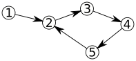

# Dead Ends Fix

The SmartGovSimulator API provides a
[fixDeadEnds](https://smartgov-liris.github.io/SmartGovSimulator/org/liris/smartgov/simulator/urban/osm/utils/OsmArcsBuilder.html#fixDeadEnds-org.liris.smartgov.simulator.urban.osm.environment.OsmContext-org.liris.smartgov.simulator.urban.osm.environment.graph.factory.OsmArcFactory-)
method to fix cases that can cause agents to be stuck in the OSM graph.

# Examples

The two following graphs show situations that we consider as simple dead ends.
Nodes 1 and 2 can be connected to anything. Node 4 is considered as a dead end,
and node 3 is optional but represented for illustration purposes.

In terms of OSM representation, the 2->3->4 way would be tagged as [oneway
roads](https://wiki.openstreetmap.org/wiki/Key:oneway). Even if it has been
encountered several times in practice, notice that such situations are
impossible in real life : a dead end can't be oneway, otherwise cars would be
indefinitely stuck in it. Either it's not a real dead end (there is an "out"
path), or it is not really oneway.

# Solution

The 
[fixDeadEnds](https://smartgov-liris.github.io/SmartGovSimulator/org/liris/smartgov/simulator/urban/osm/utils/OsmArcsBuilder.html#fixDeadEnds-org.liris.smartgov.simulator.urban.osm.environment.OsmContext-org.liris.smartgov.simulator.urban.osm.environment.graph.factory.OsmArcFactory-)
will then fix those situations creating arcs such that the final situation will
look as follow :

# Limitations

Notice that this **does not ensure the full graph connectivity**, what
represents a much bigger problem than this simple solution for relatively
common problems.

The following situations are currently **NOT** handled by the algorithm.

The A* algorithm (or any other path computation algorithm) will generally throw
"Path Not Found" errors in such situations. The responsibility is currently
left to the user to fix those special cases directly in the input file using
other methods.

## Partial dead end

In that case, node 4 could look as a dead end. However, because it's possible
to go to node 3 from node 4 and to node 4 from node 3, the algorithm does not
detect it as a dead end even if an agent would be stuck in that part of the
graph.

## Cycle

One ways cycles are also special and complex cases that are not currently
handled.

If nodes 2, 3, 4 and 5 are not connected to anything else, agents will be stuck
in the cycle.
