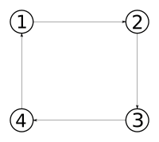

Now that we have a [newly created geographical graph](Geographical-Graph.md), let's see how we can make agent move into it in a realistic way.



To do so, we will use, **as is**, the previously implemented [ShuttleBehavior](Create-Agents.md#shuttle-behavior). Actually, because the description of such a behaviour does not depend on the nature of the nodes, it was important to make it natively usable with any kind of nodes.


Our `buildAgents` function will use the following provided classes : 
- `GeoAgent` : A `MovingAgent` with a `GeoAgentBody`
- `GeoAgentBody` : An agent body with a geographical position
- `BasicGeoMover` : A basic `GeoMover` implementation that make an agent moves realistically in the geographical environment at each ticks, according to its *speed* in m/s.

For more information, do not hesitate to check the corresponding Javadocs.

So, for now, let's build one agent, that makes round-trips between nodes 1 and 3 thanks to the `ShuttleBehavior` : 
```java
	@Override
	public Collection<GeoAgent> buildAgents(SmartGovContext context) {
		ArrayList<GeoAgent> agents = new ArrayList<>();
		
		/*
		 * A basic geographical mover that allows agent to move
		 * along arcs.
		 */
		BasicGeoMover mover = new BasicGeoMover();
		GeoAgentBody agentBody = new GeoAgentBody(mover);
		
		// default 1m/s speed
		agentBody.setSpeed(1);
		
		agents.add(new GeoAgent(
				"1",
				agentBody,
				new ShuttleBehavior(
						agentBody,
						context.nodes.get("1"),
						context.nodes.get("3"),
						context)
				));
		
		return agents;
	}
```

You can now [run a simulation](Running-simulations.md#run-a-simulation) to ensure everything is ok.
