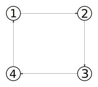

In this part, we will see how to instantiate nodes and arcs in a geographical coordinate system.

For the sake of simplicity and because basic behaviour mechanisms have already
been implemented in [a previous section](Create-Agents.md), we will use a simpler
graph to illustrate our current problem : 



The goal will be to represent those nodes using longitude / latitude coordinates. 
Next, we will also see how we can make agents move in this new graph, **without modifying our original** [_shuttle behavior_](Create-Agents.md).

# Create a new Scenario

Because we need to build new kind of nodes, we need to create a new scenario, and add it to our context.

```java
public class GeoScenario extends Scenario {
	
	public static final String name = "geoTest";

	@Override
	public Collection<? extends Node> buildNodes(SmartGovContext context) {
		return new ArrayList<>();
	}

	@Override
	public Collection<? extends Arc> buildArcs(SmartGovContext context) {
		return new ArrayList<>();
	}

	@Override
	public Collection<? extends Agent<?>> buildAgents(SmartGovContext context) {
		return new ArrayList<>();
	}

}
```

And register it in the [previously created](Create-a-SmartGov-project.md#register-the-scenario) `TestContext` as follow : 
```java
public class TestContext extends SmartGovContext {

	public TestContext() {
		super("./testConfig.properties");
	}
	
	@Override
	public Scenario loadScenario(String name) {
		switch(name) {
			case TestScenario.name:
				return new TestScenario();
			case GeoScenario.name:
				return new GeoScenario();
			default:
				return null;
		}
	}

}
```

Don't forget to modify your [configuration input file](Create-a-SmartGov-project.md#configuration-file) as follow:
```
scenario=GeoScenario
```
And eventually [launch your app](Running-simulations.md#run-a-simulation) to be sure that the right scenario is loaded.

# Create nodes

Now, in the usual `buildNodes` function, let's create 4 nodes with longitude / latitude coordinates as follow :
```java
	@Override
	public Collection<GeoNode> buildNodes(SmartGovContext context) {
		ArrayList<GeoNode> nodes = new ArrayList<>();
		
		nodes.add(
			new GeoNode(
				"1",
				new LatLon(45.7829296, 4.8680849)
				)
			);
		nodes.add(
			new GeoNode(
				"2",
				new LatLon(45.7822063, 4.8648563)
				)
			);
		nodes.add(
			new GeoNode(
				"3",
				new LatLon(45.7842329, 4.865034)
				)
			);
		nodes.add(
			new GeoNode(
				"4",
				new LatLon(45.7844936, 4.8673742)
				)
			);
		
		return nodes;
	}
```

# Create arcs

Creating geographical graph is even simpler, because the input geographical data are actually contained in the nodes.
The only difference with standard arcs is that you don't need to specify the `length` of the arc, because it will be
computed as the length of the arc in meters, from the input coordinates.

So according to the graph previously presented, implement the `buildArcs` function as follow :
```java
	@Override
	public Collection<GeoArc> buildArcs(SmartGovContext context) {
		ArrayList<GeoArc> arcs = new ArrayList<>();
		
		arcs.add(
			new GeoArc(
				"1",
				(GeoNode) context.nodes.get("1"),
				(GeoNode) context.nodes.get("2")
				)
			);
		
		arcs.add(
			new GeoArc(
				"2",
				(GeoNode) context.nodes.get("2"),
				(GeoNode) context.nodes.get("3")
				)
			);
		
		arcs.add(
			new GeoArc(
				"3",
				(GeoNode) context.nodes.get("3"),
				(GeoNode) context.nodes.get("4")
				)
			);
		
		arcs.add(
			new GeoArc(
				"4",
				(GeoNode) context.nodes.get("4"),
				(GeoNode) context.nodes.get("1")
				)
			);
		
		return arcs;
	}
```
