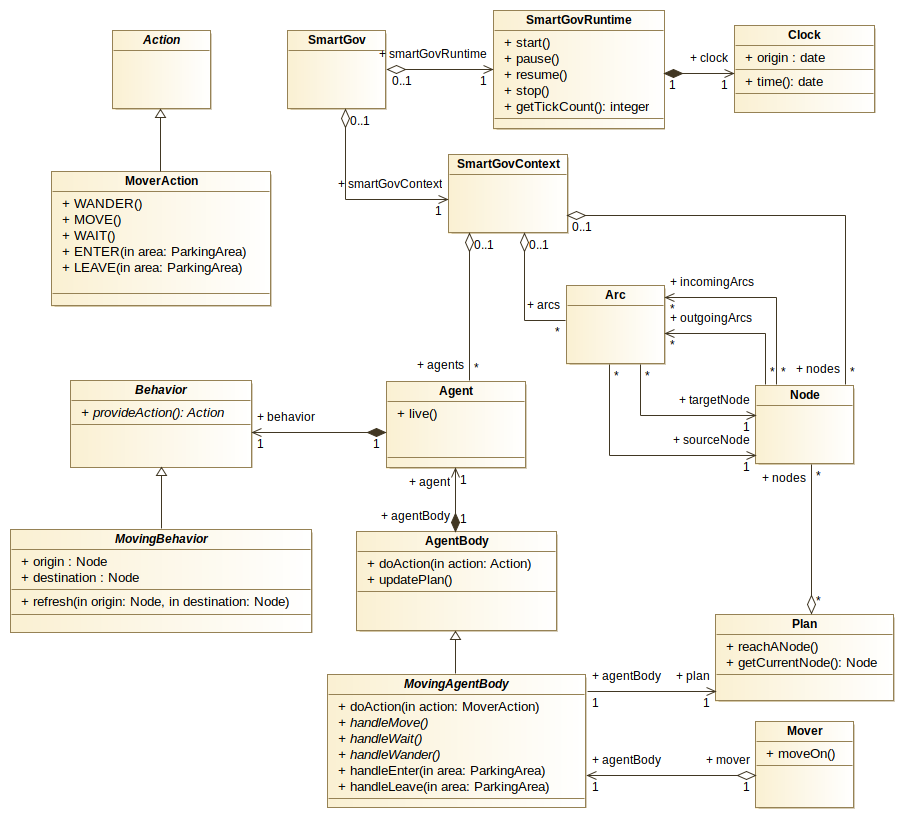

# Get Started

1. [Install and build the SmartGovSimulator](#install-and-build-the-smartgovsimulator)
2. [The simulator structure](#the-simulator-structure)

## Install and build the SmartGovSimulator
The SmartGov simulator can be added to your project as a Gradle dependency. To do so : 
1. Create a new Gradle project, using the `gradle` command line utility or your favourite IDE. 
2. Add the following lines to your `build.gradle` file : 

To the `repositories` section, add : 
```
maven { url 'https://jitpack.io' }
```
And, in the `dependencies`, add : 
```
implementation 'com.github.smartgov-liris:SmartGovSimulator:master-SNAPSHOT'
```

All the SmartGov classes should now be available in your project.

> Note : In Eclipse, you should have to *right click on your project* > *Gradle* > *refresh Gradle project*

## The simulator structure

The following class diagram explains the main SmartGovSimulator structure (low level simulation only) :



Each SmartGov instance is constituted by two main components :
- a SmartGovContext, that contains all the information about a simulation environment
- a SmartGovRuntime, that will run the simulation. Concretely, it contains a loop that will call the `live()` on agents contained in the SmartGovContext.

`Node`s and `Arc`s describe a `Graph` navigable by agents.

To do so, each `Agent` is actually constituted by :
- an head, that is the actual `Agent` instance. It represents the agent "mind", its behavior.- The `AgentBody` is the part of the `Agent` that physically interact with the environment, performing actions such as `MOVE` or `WAIT`.


The `MovingAgentBody` is a first implementation level of `AgentBody`, that
provides convenient methods for classic *move* actions. It is associated to a
`Mover`, that is used to move between `Node`s in the `Plan`. The `Mover` can
for example represent a car mover, but it can represent many other abstract
concepts.

The `Plan` is a list of `Node`s to cross to go from the agent origin to its destination.

The `MovingBehavior` defines convenient methods to automatically compute
trajectories between origin and destination nodes. The behavior can be
refreshed with new origin / destination at any time, even if the agent has not
reached its destination yet : those mechanisms should be detailed in the
concrete behavior implementation.

Now that you should be familiar with the core concept of the simulation, you can go to the [next section](Create-a-SmartGov-project) to learn how to create your first SmartGov project.
