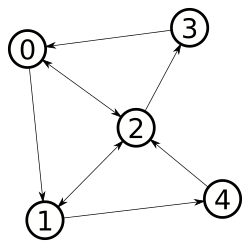

# Build a simple graph

Nodes are the first important structure of any SmartGov simulation. They are
used to represent OSM nodes, buildings, parking spots are any other punctual
object with which agents can interact with. They can even be used to represent
more abstract concepts.

Nodes can then be connected between them using Arcs. An Arc represents a
structure that an agent can use to *travel* between nodes.

Even if you are more likely to use some geolocalised nodes in your simulation,
it's important to understand the behaviour of the simulator with basic nodes.
Moreover, Nodes and GeoNodes instantiation are very similar. Also, basic Nodes
and Arcs are the structures that allow SmartGov extensibility to complex
problems.

This example will describe how you can instanciate programmatically the
following graph.



More powerful methods are also defined to load a graph from OSM using a JSON
input file, but this will be describe in a next section.

> This example assumes that you have successfully created a basic SmartGov project. Else, see [this section](Create-a-SmartGov-project).

## Table Of Content
1. [The Node class](#the-node-class)
1. [Nodes Instantiation](#nodes-instantiation)
1. [The Arc class](#the-arc-class)
1. [Arcs Instantiation](#arcs-instantiation)
1. [Complete workflow](#complete-workflow)

## The Node class
Basically, a Node contains 3 information : 
- an ID
- a list of incoming Arcs
- a list of outgoing Arcs

For the detailed API, check the complete [Node
reference](https://smartgov-liris.github.io/SmartGovSimulator/org/liris/smartgov/simulator/core/environment/graph/Node.html).

## Nodes Instantiation

To create Nodes, you can override the `buildNodes` function as follow in the
[TestScenario](Create-a-SmartGov-project#create-a-scenario) :

```java
	@Override
	public Collection<? extends Node> buildNodes(SmartGovContext context) {
		ArrayList<Node> testNodes = new ArrayList<>();
		for(int i = 0; i < 5; i++) {
			testNodes.add(new Node(String.valueOf(i)));
		}
		return testNodes;
	}
```

## The Arc class
Arcs are oriented links between Nodes. Non-oriented arcs (or bi-directionnal arcs) are represented with two Arcs between two nodes.

An Arc has 4 properties : 
- an ID
- a source Node
- a target Node
- a length, used to compute shortest paths for example. Notice that this length does not necessarily correspond to distances.

For the detailed API, check the complete [Arc
reference](https://smartgov-liris.github.io/SmartGovSimulator/org/liris/smartgov/simulator/core/environment/graph/Arc.html).

## Arcs Instantiation
Let's create Arcs that correspond to the example graph pictured in [the introduction](#build-a-simple-graph), with equal lengths.

Here is the corresponding `buildArcs` implementation :

```java
@Override
	public Collection<? extends Arc> buildArcs(SmartGovContext context) {
		Map<String, Node> nodes = context.nodes;
		
		// Creating Arcs
		ArrayList<Arc> testArcs = new ArrayList<>();
		testArcs.add(new Arc("1", nodes.get("0"), nodes.get("1"), 1));
		testArcs.add(new Arc("2", nodes.get("1"), nodes.get("4"), 1));
		testArcs.add(new Arc("3", nodes.get("1"), nodes.get("2"), 1));
		testArcs.add(new Arc("4", nodes.get("4"), nodes.get("2"), 1));
		testArcs.add(new Arc("5", nodes.get("2"), nodes.get("3"), 1));
		testArcs.add(new Arc("6", nodes.get("3"), nodes.get("0"), 1));
		testArcs.add(new Arc("7", nodes.get("0"), nodes.get("2"), 1));
		testArcs.add(new Arc("8", nodes.get("2"), nodes.get("0"), 1));
		testArcs.add(new Arc("9", nodes.get("1"), nodes.get("2"), 1));
		testArcs.add(new Arc("10", nodes.get("2"), nodes.get("1"), 1));

		return testArcs;
	}
```

Notice that we call the `nodes` created in the next section from the context.
This is made possible, because build functions are called in the following
order when a scenario is instantiated :

1. `buildNodes`
2. `buildArcs`
3. `buildAgents`

Built items are added to the context at each step, using their id as a key in
the corresponding context maps.

## Complete Workflow

Now, run your app, and you should obtain the following output : 
```

06:57:34.372 [main] INFO  org.liris.smartgov.simulator.SmartGov - Loading config from ./testConfig.properties
06:57:34.376 [main] INFO  org.liris.smartgov.simulator.SmartGov - Starting SmartGov
06:57:34.379 [main] INFO  org.liris.smartgov.simulator.SmartGov - Loading World for TestScenario
06:57:34.380 [main] INFO  org.liris.smartgov.simulator.SmartGov - 5 nodes added to SmartGovContext
06:57:34.380 [main] INFO  org.liris.smartgov.simulator.SmartGov - 10 arcs added to SmartGovContext
06:57:34.381 [main] INFO  org.liris.smartgov.simulator.SmartGov - Creating the simulation Graph
06:57:34.381 [main] INFO  org.liris.smartgov.simulator.SmartGov - 0 agents added to SmartGovContext
06:57:34.381 [main] INFO  org.liris.smartgov.simulator.SmartGov - Time to process simulation creation: 3 ms.
```

If everything is fine until there, you can now go to the [next
section](Create-Agents) to learn how to create agents and implement a basic
behaviour.

